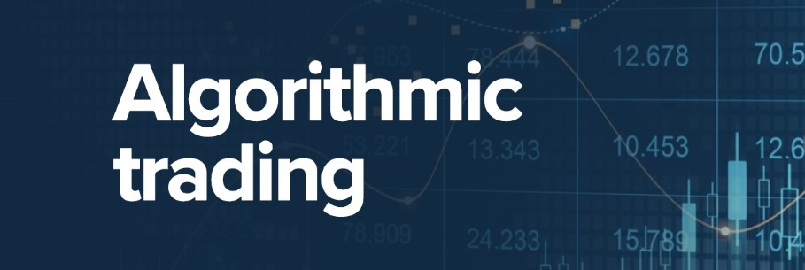

# Algorithmic trading

### Описание

Реализация алгоритмов интерполяции и аппроксимации для заданного набора данных. 
Используя эти алгоритмы, приложение способно строить графики вероятностного поведения котировок акций на заданные даты на основе исторических данных без учета внешних факторов.

### Сборка и установка

Для сборки и запуска программы необходимо установить библиотеку **QT4 или новее**.

Сборка осущетствляется в папке с исходными файлами с помощью команд **`make`** или **`make all`** или **`make install`**.

Исполняемый файл **AlgorithmicTrading** после сборки будет находиться в папке *build*

### Использование
- Загрузите набор данных, используя кнопку **`Load data`** (примеры данных находятся в папке *datasets*)
- Выберите вкладку - **`Interpolation`** или **`Aproximation`**
- Укажите необходимые данные в левой части приложения
- Нажмите кнопку **`Draw graph`**, чтобы построить график прогноза котировок акций 
- Либо получите ориентировочную стоимость акций на заданную дату с помощью кнопки **`Forecast price`**

### Авторы
- https://github.com/dmnAlex
- https://github.com/dsnikitin
